# Microservices Billing Application

Application de facturation avec architecture microservices - Spring Boot + Angular

## Technologies

**Backend:** Spring Boot 3.5.7, Spring Cloud 2025.0.0, Eureka, Gateway, OpenFeign, H2, Java 21
**Frontend:** Angular 19, TypeScript, RxJS

## Architecture

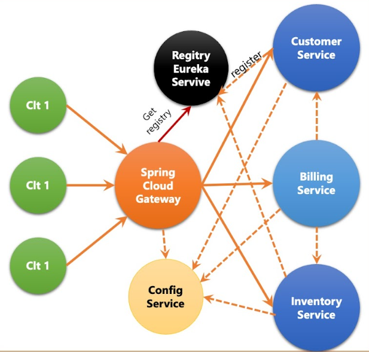

## Services

| Service   | Port | Endpoint                            |
| --------- | ---- | ----------------------------------- |
| Angular   | 4200 | http://localhost:4200               |
| Eureka    | 8761 | http://localhost:8761               |
| Gateway   | 8888 | http://localhost:8888               |
| Customer  | 8081 | http://localhost:8081/api/customers |
| Inventory | 8082 | http://localhost:8082/api/products  |
| Billing   | 8083 | http://localhost:8083/bills/{id}    |

## Documentation

### Backend Services

#### Customer Service

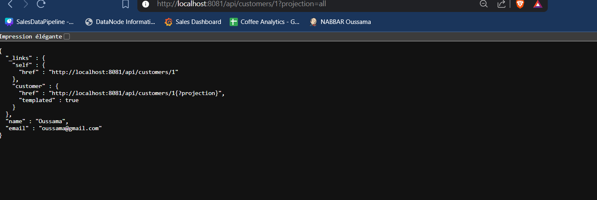

#### Inventory Service

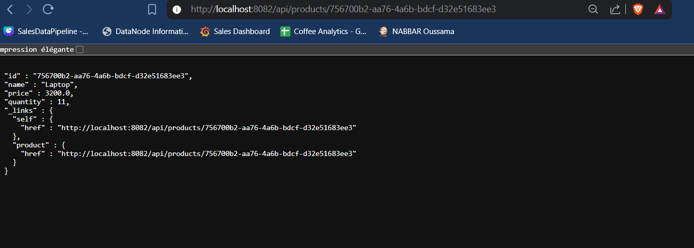

#### Billing Service (OpenFeign)

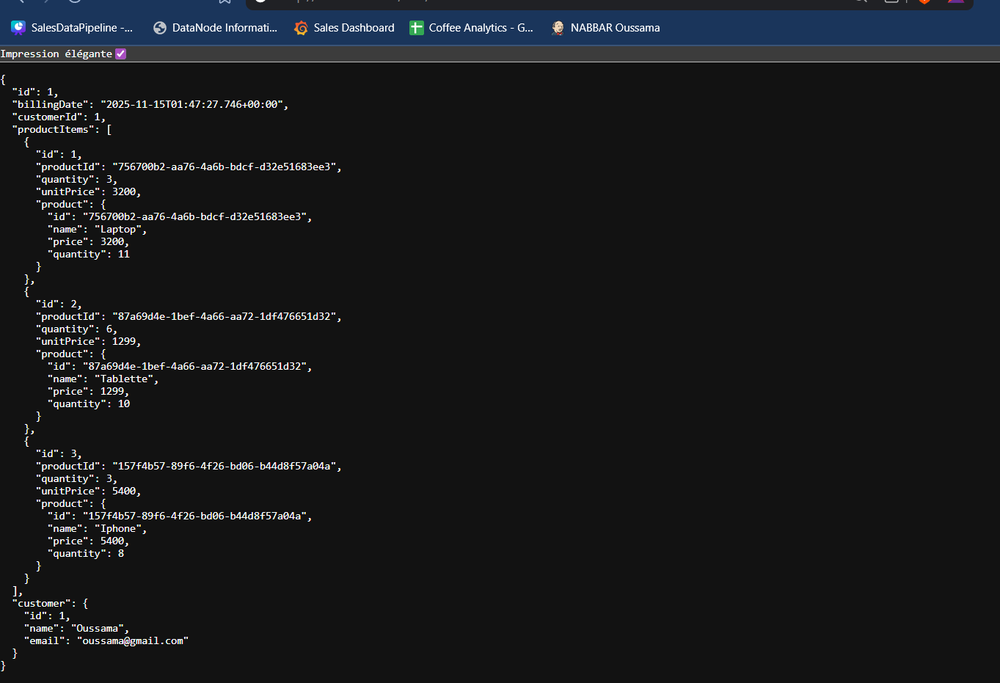

#### Eureka Dashboard

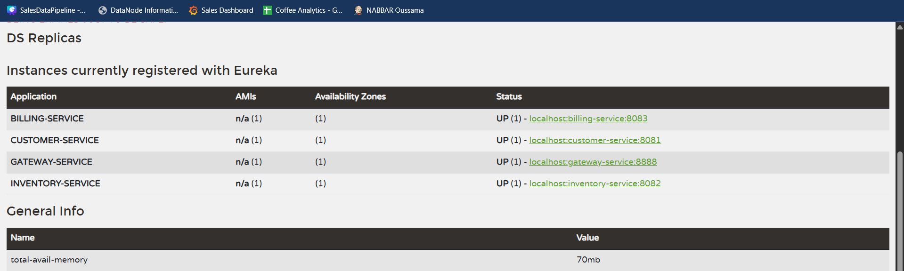

#### Gateway Configuration

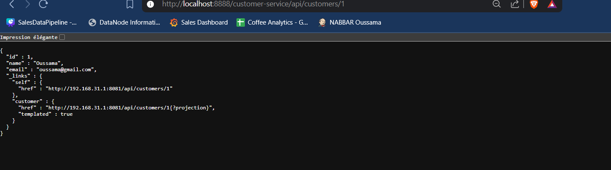
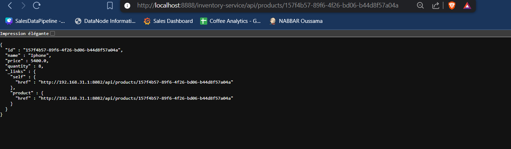

#### OpenFeign Clients

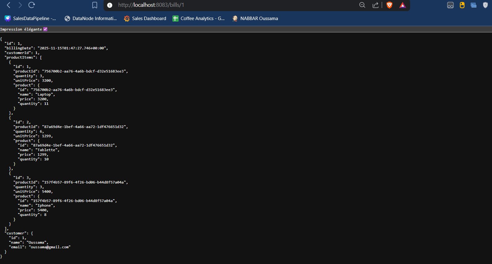

### Frontend Angular

#### Customers Page

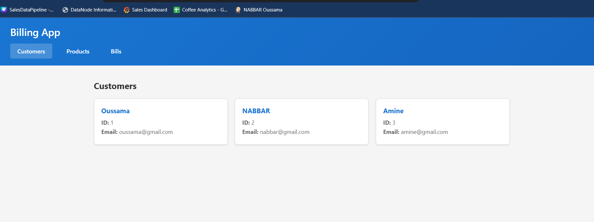

#### Products Page

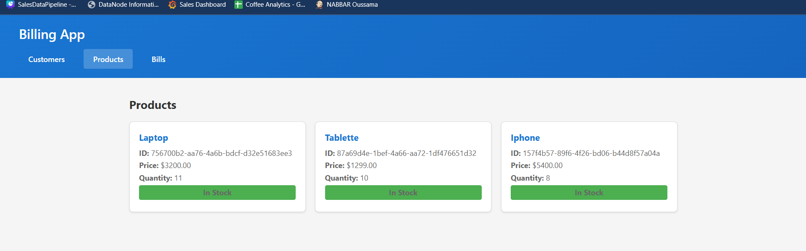

#### Bills Page

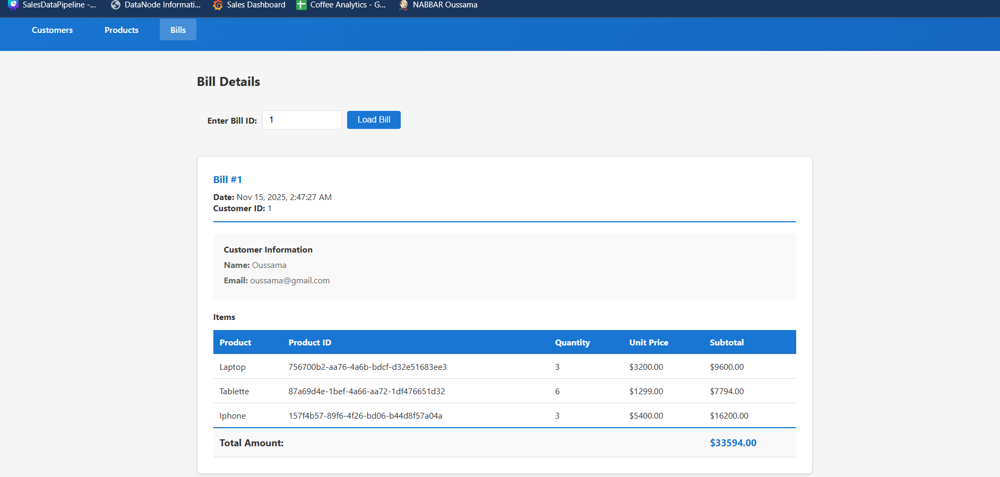
